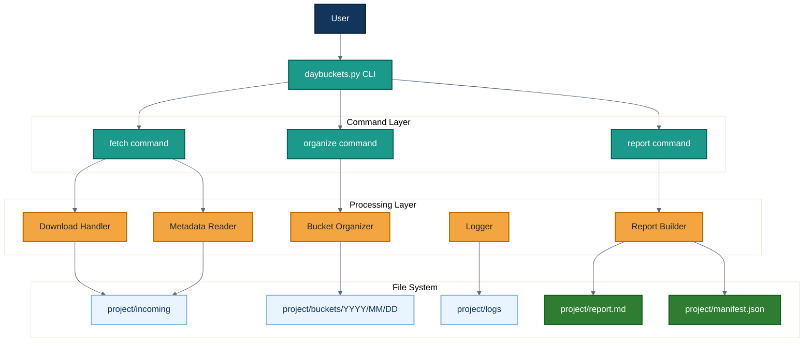
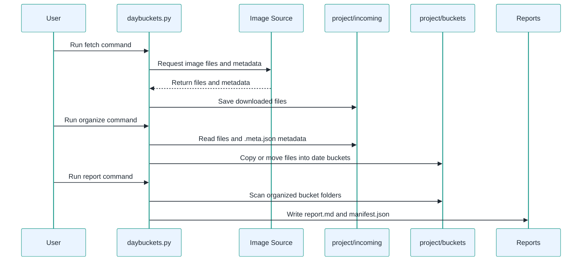
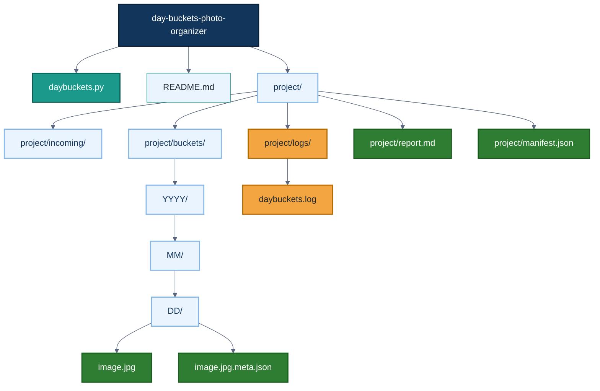
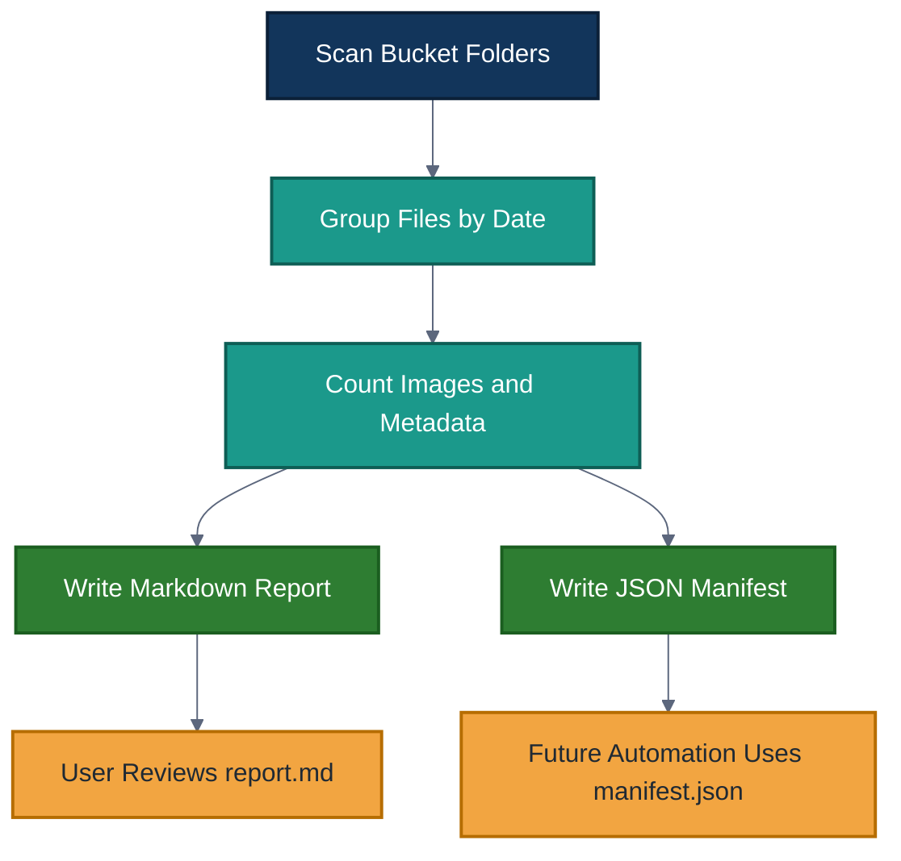
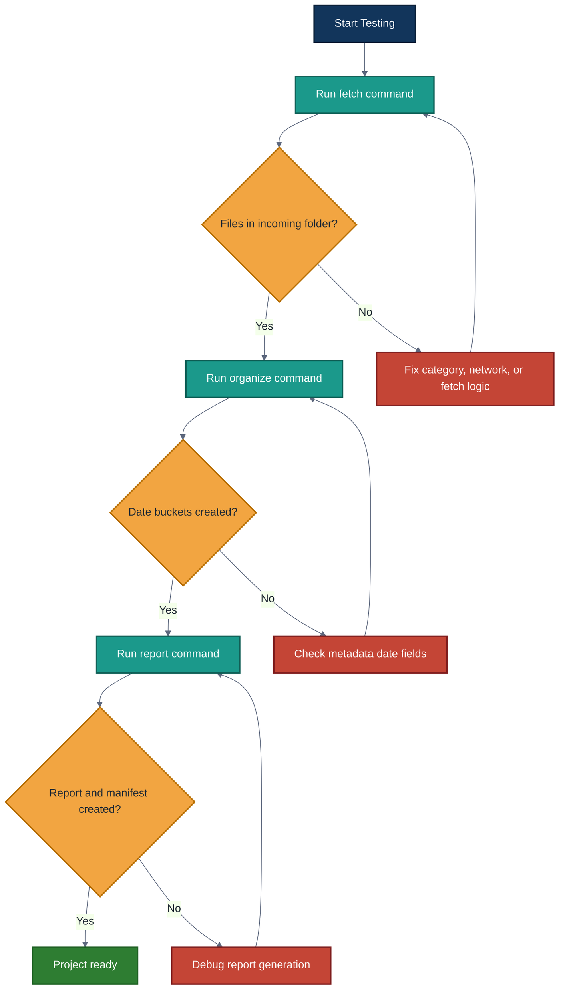

# Day Buckets Photo Organizer

A Python command-line automation tool that fetches image files and metadata, organizes them into date-based folders, and generates structured reports.

This project demonstrates process automation, file handling, metadata parsing, CLI design, logging, and repeatable data organization workflows.

## Table of Contents

- [Project Overview](#project-overview)
- [Features](#features)
- [System Workflow](#system-workflow)
- [Architecture](#architecture)
- [Data Flow](#data-flow)
- [Project Structure](#project-structure)
- [Technology Stack](#technology-stack)
- [Setup Instructions](#setup-instructions)
- [Usage](#usage)
- [Example Output](#example-output)
- [Generated Files](#generated-files)
- [Testing Checklist](#testing-checklist)
- [Troubleshooting](#troubleshooting)
- [Future Improvements](#future-improvements)

## Project Overview

Day Buckets Photo Organizer is a Python CLI project that organizes downloaded images into folders based on date metadata.

The project workflow is built around three main steps:

1. Fetch image files and metadata into an incoming folder.
2. Organize files into `YYYY/MM/DD` date buckets.
3. Generate a human-readable report and a machine-readable manifest.

This makes it easier to manage photo collections, audit downloaded content, and keep files organized in a predictable structure.

## Features

- Command-line interface
- Image and metadata fetching workflow
- Date-based folder organization
- `YYYY/MM/DD` bucket structure
- Sidecar `.meta.json` metadata support
- Markdown report generation
- JSON manifest generation
- Logging support
- Dry-run mode for safe testing
- Standard-library-focused design

## System Workflow

```mermaid
%%{init: {'theme': 'base', 'themeVariables': { 'primaryColor': '#EAF4FF', 'primaryTextColor': '#1F2933', 'primaryBorderColor': '#1B998B', 'lineColor': '#5C677D', 'fontFamily': 'Arial'}}}%%
flowchart LR
    start["Start CLI Command"] --> fetch["Fetch Images and Metadata"]
    fetch --> incoming["Store in Incoming Folder"]
    incoming --> organize["Organize by Date"]
    organize --> buckets["Create YYYY/MM/DD Buckets"]
    buckets --> report["Generate Report"]
    buckets --> manifest["Generate Manifest"]
    report --> done["Review Output"]
    manifest --> done

    classDef startClass fill:#12355B,color:#FFFFFF,stroke:#0B2038,stroke-width:2px;
    classDef processClass fill:#1B998B,color:#FFFFFF,stroke:#0E5E55,stroke-width:2px;
    classDef storageClass fill:#EAF4FF,color:#12355B,stroke:#86B7E7,stroke-width:2px;
    classDef outputClass fill:#2E7D32,color:#FFFFFF,stroke:#1B5E20,stroke-width:2px;
    classDef finalClass fill:#F2A541,color:#1F2933,stroke:#B66D00,stroke-width:2px;

    class start startClass
    class fetch,organize processClass
    class incoming,buckets storageClass
    class report,manifest outputClass
    class done finalClass
```



## Architecture



## Data Flow



## Project Structure



## Technology Stack

| Component | Purpose |
| --- | --- |
| Python | Main programming language |
| argparse | Command-line argument handling |
| pathlib / os | File and folder operations |
| json | Metadata and manifest handling |
| datetime | Date parsing and bucket organization |
| logging | Execution logs and debugging |
| Markdown | Human-readable report output |
| GitHub | Version control and portfolio hosting |

## Setup Instructions

### 1. Clone the Repository

```bash
git clone https://github.com/djdcybersecurity/day-buckets-photo-organizer.git
cd day-buckets-photo-organizer
```

### 2. Check Python Version

```bash
python --version
```

Recommended:

```text
Python 3.10+
```

### 3. Confirm the Script Exists

```bash
ls
```

You should see:

```text
daybuckets.py
README.md
project/
```

## Usage

The project uses three main commands:

1. `fetch`
2. `organize`
3. `report`

### Step 1: Fetch Images and Metadata

```bash
python daybuckets.py fetch --category "Cathedrals" --dest ./project --limit 3 --verbose
```

This downloads image files and matching `.meta.json` files into:

```text
project/incoming/
```

### Step 2: Organize Files into Date Buckets

```bash
python daybuckets.py organize --dest ./project --mode copy --verbose
```

This organizes files into folders like:

```text
project/buckets/YYYY/MM/DD/
```

Use `copy` mode to keep the original files in `incoming/`.

### Step 3: Generate Report and Manifest

```bash
python daybuckets.py report --dest ./project --verbose
```

This creates:

```text
project/report.md
project/manifest.json
```

## Dry-Run Testing

Use dry-run mode to preview actions without changing files:

```bash
python daybuckets.py organize --dest ./project --mode copy --dry-run --verbose
```

Dry-run mode is useful before moving or copying files.

## Example Output

Example bucket structure:

```text
project/
  incoming/
    example.jpg
    example.jpg.meta.json
  buckets/
    2025/
      09/
        20/
          example.jpg
          example.jpg.meta.json
  logs/
    daybuckets.log
  report.md
  manifest.json
```

## Generated Files

| File | Purpose |
| --- | --- |
| `project/incoming/` | Stores fetched images and metadata before organization |
| `project/buckets/` | Stores organized date-based folders |
| `project/logs/daybuckets.log` | Tracks actions and errors |
| `project/report.md` | Human-readable summary of organized files |
| `project/manifest.json` | Machine-readable inventory of organized files |

## Report Generation



## Testing Checklist

Use this checklist to verify the project works correctly:



## Troubleshooting

| Issue | Possible Cause | Fix |
| --- | --- | --- |
| No files downloaded | Invalid category, network issue, or fetch limit too low | Try another category and confirm internet access |
| Files stay in `incoming/` | Organize step was not run | Run the `organize` command |
| Buckets use the wrong date | Metadata timestamp is missing or unexpected | Check the `.meta.json` file |
| Report is empty | No files exist in `project/buckets/` | Run fetch and organize first |
| Permission error | Folder is locked or file is open elsewhere | Close open files and retry |
| Command not recognized | Python path issue | Try `python3` instead of `python` |

## Future Improvements

Planned improvements include:

- Add stronger metadata validation.
- Add duplicate file detection.
- Add support for custom date fields.
- Add CSV export.
- Add image count summaries by month and year.
- Add automated tests for bucket creation.
- Add GitHub Actions checks.
- Add configuration file support.
- Add error reporting for failed downloads.
- Add cleanup mode for empty folders.
- Add support for multiple source categories in one run.

## Author

Developed and maintained by Daren Johnson.
